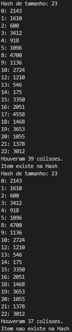
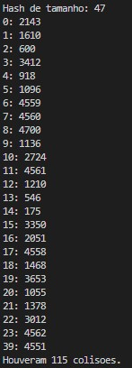

# Submatrix_Multiplication
O objetivo do problema é implementar um uma multiplicação entre uma submatriz lida de um arquivo e sua matriz transposta. Além de inserir o resultado em uma hash, e caso tal matriz seja pesquisada novamente, restornar o resultado já inserido.
# Estrutura
Temos uma estrutura baseada de [Open_Hash](https://github.com/Couto1411/Open_Hash), contendo os devidos ajustes para comportar em cada objeto da hash, uma matriz e suas coordenadas do arquivo. (Portanto apenas os métodos relacionados à matriz serão abordados)
# Logica

O programa possui alguns métodos importantes: *readMatrix()*, *mulMat()*, *transpose()* e *printMatrix()*.
1) int **readMatrix(int coords[4]):      
Este método é responsável por ler de um arquivo nomeado "matriz.txt" contido na pasta "arquivos". Ele utiliza de um lógica que pula uma quantidade de linhas e colunas utilizando a função *.ignore()* da biblioteca <fstream>, quantidade determinada pelas coordenadas presentes no array encaminhado. Após encontrar o início da submatriz, o programa lê a quantidade de colunas definidas pelas coordenadas recebidas e pula o resto da linha e as colunas da próxima linha até encontrar a coluna inicial da matriz novamente.

2) int** mulMat(int **matA, int **matB, int coords[4]):      
Programa baseado de [Program to multiply two matrices](https://www.geeksforgeeks.org/c-program-multiply-two-matrices/), o programa possui três algoritmos, um para matrizes retangulares e quadradas e um para cada uma dessas separado. Como é possível obter ambos os tipos de matrizes, foi-se utilizado o primeiro algoritmo.

3) int** transpose(int **A,int coords[4]):       
Programa baseado de [Program to find transpose of a matrix](https://www.geeksforgeeks.org/program-to-find-transpose-of-a-matrix/), o programa possui três algoritmos, um que transpõe a matriz nela mesma, ou seja, "perdendo" a matriz original, e dois que armazenam em uma nova variável. Como necessitamos da matriz original para a multiplicação, foi-se ultilizado um dos que armazenam em uma nova variável..

4) void printMatrix(Entry *mat):       
Recebe um objeto da hash e utiliza as coordenadas presentes nele para printar a matriz também presente no mesmo. (Utilizado principalmente para printar o resultado de uma matriz já existente)

- O main funciona da seguinte forma:     
    1 - Cria uma hash de tamanho 1;      
    2 - Seta as coordenadas da primeira matriz, lê a mesma, calcula a tranposta e insere a multiplicação;     
    3 - A partir do segundo conjunto de coordenadas, primeiro é pesquisado esse conjunto na hash. Caso o resultado seja nulo, repete os passos de (2), caso não seja utiliza o retorno da busca para printar o resultado já calculado;    
    4 - Repete a busca e inserção n vezes.

Obs.:      
- O programa não aceita entrada de usuários, ele utiliza coordenadas estáticas já implementadas, caso seja necessário deve-se criar um input para as mesmas;      
- O método de hash do repositório citado foi modificado para calcular a chave a partir das coordenas da matriz;    
- Assim como a busca foi modificada para achar um resultado já calculado a partir da chave e das coordenadas;    
- Arquivo de formato:

> a1 a4 a7 ...    
> a2 a5 a8 ...    
> a3 a6 a9 ...    
> ... ... ... ...  

- an sendo um inteiro qualquer.

# Exemplo de execução
O main do programa está implementado para inserir 3 valores na Hash, printar a Hash após iserção, buscar um número que existe, inserir mais um números, printar a Hash.    
Valores inseridos:

> {0,0,3,4}
> {1,1,5,5}
> {1,1,4,7}
> {1,1,5,5}

Execução:

	 

    

	 

   

# Compilação e Execução

O programa possui um arquivo Makefile que realiza todo o procedimento de compilação e execução. Para tanto, temos as seguintes diretrizes de execução:

| Comando                |  Função                                                                                           |                     
| -----------------------| ------------------------------------------------------------------------------------------------- |
|  `make clean`          | Apaga a última compilação realizada contida na pasta build                                        |
|  `make`                | Executa a compilação do programa utilizando o gcc, e o resultado vai para a pasta build           |
|  `make run`            | Executa o programa da pasta build após a realização da compilação                                 |
